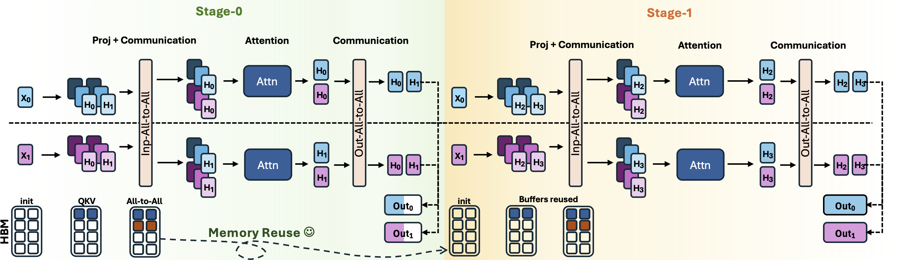

# Untied-Ulysses


<div align="center">


[](https://arxiv.org/abs/2602.21196)
[](https://img.shields.io/github/license/togethercomputer/Untied-Ulysses)

</div>

An official implementation of **Untied Ulysses**, a context parallelism method for training LLMs on extremely long contexts (up to 5M tokens on a single H100 node for 8B models).

## Prerequisites

- NVIDIA GPUs (currently tested on the Hopper architecture)
- CUDA toolkit installed (note your exact version, e.g., `nvcc --version`)
- Python 3.10+
- `uv` package manager

## Installation

```bash
# From repo root
uv venv && source .venv/bin/activate

cd torchtitan
uv pip install torch==2.9
uv pip install flash-attn==2.8.3 --no-build-isolation --no-cache
uv sync --no-build-isolation --active

cd ../long-context-attention
uv pip install -e .
```

**Optional: FlashAttention 3 (Hopper GPUs)**

Required to reproduce exact tokens/second numbers from the paper.

```bash
git clone https://github.com/Dao-AILab/flash-attention
cd flash-attention/hopper
uv pip install -U setuptools wheel packaging ninja
MAX_JOBS=128 uv pip install . --no-build-isolation
cd ../..
```

## Usage

### Scripts

Scripts to reproduce Table 3 and Figure 5 from the paper are in `torchtitan/exps/`.

| Model | Script | Description |
|-------|--------|-------------|
| LLaMA 8B | `llama3_8b/run_single_8B.sh` | Single experiment |
| LLaMA 8B | `llama3_8b/run_all_8B.sh` | Full benchmark (128K-5M) |
| LLaMA 8B | `llama3_8b/run_single_multinode_8B.sh` | Single experiment (2 nodes) |
| LLaMA 8B | `llama3_8b/run_all_multinode_8B.sh` | Full benchmark (512K-8M, 2 nodes) |
| Qwen3 32B | `qwen3_32b/run_single_multinode_32B.sh` | Single experiment (multinode) |
| Qwen3 32B | `qwen3_32b/run_all_multinode_32B.sh` | Full benchmark (128K-4M, multinode) |

### Quick Start

```bash
cd torchtitan/exps/llama3_8b

# Run single experiment
CONTEXT_LENGTH=131072 bash run_single_8B.sh

# Run all experiments
bash run_all_8B.sh
```

### Multi-Node

Run the same command on **both nodes** simultaneously:

```bash
cd torchtitan/exps/llama3_8b
NNODES=2 RDZV_ENDPOINT="master-hostname:29500" bash run_single_multinode_8B.sh

# Or for Qwen3 32B
cd torchtitan/exps/qwen3_32b
NNODES=2 RDZV_ENDPOINT="master-hostname:29500" bash run_single_multinode_32B.sh
```

### Configuration

| Variable | Default | Description |
|----------|---------|-------------|
| `CONTEXT_LENGTH` | 2M (8B) / 128K (32B) | Sequence length |
| `STEPS` | 10 | Training steps |
| `BATCH_SIZE` | 1 | Batch size |
| `NNODES` | 1 | Number of nodes |
| `NPROC_PER_NODE` | 8 | GPUs per node |
| `RDZV_ENDPOINT` | localhost:29500 | Master node (multinode only) |

### Attention Methods

| `attn_impl` | Description |
|-------------|-------------|
| `upipe_fa2_offload_tiled_mlp` | **Untied Ulysses (ours)** |
| `usp_fa2_offload_tiled_mlp` | USP zigzag baseline |
| `torch_ring_alltoall` | PyTorch baseline |

For Hopper GPUs, use `_fa3_` variants instead of `_fa2_` (i.e., replace the `_fa2_` in the `attn_impl` name)

### FPDT (Fully Pipelined Distributed Transformer) Baseline
<details>
<summary>Instructions to reproduce</summary>

Scripts and configurations for running FPDT experiments using Megatron-DeepSpeed with long context sequence parallelism.

#### Installation

```bash
# From repo root
uv venv fpdt_env && source fpdt_env/bin/activate

# Install PyTorch (must match your system CUDA from `nvcc --version`: cu124, cu121, cu118, etc.)
uv pip install torch==2.8.0 torchaudio==2.8.0 torchvision --index-url https://download.pytorch.org/whl/test/cu129

git clone https://github.com/NVIDIA/apex.git
cd apex
APEX_CPP_EXT=1 APEX_CUDA_EXT=1 uv pip install -v --no-build-isolation ./
cd ..
uv pip install transformers six pybind11 psutil
uv pip install flash-attn==2.8.2 --no-build-isolation
uv pip install deepspeed==0.17.4
```

**Optional: FlashAttention 3 (Hopper GPUs)**

Required to reproduce exact tokens/second numbers from the paper.

```bash
git clone https://github.com/Dao-AILab/flash-attention
cd flash-attention/hopper
uv pip install -U setuptools wheel packaging ninja
MAX_JOBS=128 uv pip install . --no-build-isolation
cd ../..
```

#### Usage

##### Scripts

Scripts are in `FPDT/Megatron-DeepSpeed/examples_deepspeed/sequence_parallel/`.

| Model | Script | Description |
|-------|--------|-------------|
| LLaMA 8B | `run_single_8B.sh` | Single experiment |
| LLaMA 8B | `run_all_8B.sh` | Full benchmark (128K-5M) |
| Qwen3 32B | `run_single_32B.sh` | Single experiment |
| Qwen3 32B | `run_all_32B.sh` | Full benchmark |
| Qwen3 32B | `run_single_multinode_32B.sh` | Single experiment (multinode) |
| Qwen3 32B | `run_all_multinode_32B.sh` | Full benchmark (multinode) |

#### Quick Start

```bash
cd FPDT/Megatron-DeepSpeed/examples_deepspeed/sequence_parallel

# Run single experiment (optionally pass sequence length)
./run_single_8B.sh
./run_single_8B.sh 262144  # 256K context

# Run all experiments
./run_all_8B.sh
```

#### Configuration

These flags are pre-configured in the scripts ([example](FPDT/Megatron-DeepSpeed/examples_deepspeed/sequence_parallel/run_single_8B.sh#L173-L176)):

| Flag | Description |
|------|-------------|
| `--ds-sequence-parallel-fpdt` | Enables FPDT mode |
| `--ds-sequence-parallel-size N` | Sequence parallel degree (default: 8) |
| `--ds-sequence-parallel-fpdt-chunk-size N` | Chunk size (default: 65536) |
| `--ds-sequence-parallel-fpdt-offloading` | Activation offloading to CPU |
| `--use-flash-attn-v3` | Flash Attention v3 (default) |
| `--use-flash-attn-v2` | Flash Attention v2 |
</details>

## Citation

If you found our work to be useful in your research, please consider adding the following reference:

```
@article{untied_ulysses,
      title={{Untied Ulysses: Memory-Efficient Context Parallelism via Headwise Chunking}}, 
      author={Ravi Ghadia and Maksim Abraham and Sergei Vorobyov and Max Ryabinin},
      year={2026},
      journal={arXiv},
      url={https://arxiv.org/abs/2602.21196}, 
}
```
